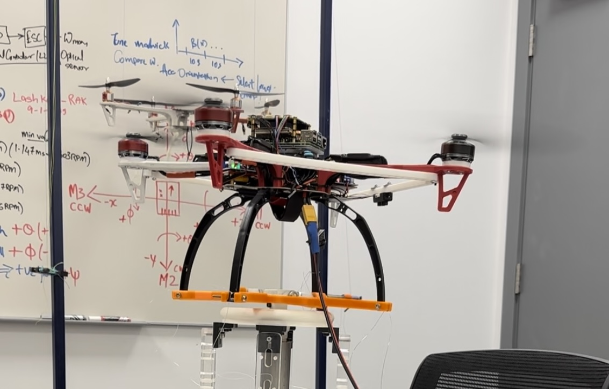

# Navio2 Quadcopter Autopilot Stack (Raspberry Pi 4)

Navio2-based quadcopter control stack for Raspberry Pi 4. 
Frame: F450. Motors: T-Motor MN3508 (KV). 
This repo contains flight-control experiments, sensor drivers, IMU filters, logging, and analysis tools.

**Scope**
- Real hardware control on Navio2 + Raspberry Pi 4.
- Multiple controller/estimator iterations stored as versioned scripts in `main/` and `tests/`.

**Hardware**
- IMU: MPU9250 or LSM9DS1
- Barometer: MS5611
- LiDAR: serial rangefinder
- GPS: u-blox (SPI)
- RC input, ADC, Navio2 RGB LEDs

**Dependencies**
- Python 3.7+
- numpy, scipy, matplotlib
- spidev, smbus, pyserial, psutil, RPi.GPIO

**Paths**
- Many scripts hardcode `/home/pi/Documents/Quadcopter_Control_v2` in `sys.path`.

**Run**
- Choose the control loop you want in `main/` and run with `python3` (many scripts require `sudo`).
- Optional safety idle PWM: `python3 main/idle_pwm_signal.py &`

**Project Map**
**analysis**
| File | Purpose |
| --- | --- |
| `analysis/display_controller_metrics.py` | Compute IAE/ITAE/ISE/RMSE, overshoot, settling time, mean motor speeds. |
| `analysis/plot_results.py` | Plot altitude/attitude references, errors, and control inputs. |

**examples**
| File | Purpose |
| --- | --- |
| `examples/ADC.py` | Read ADC channels and print voltages. |
| `examples/AccelGyroMag.py` | Read IMU (MPU9250 or LSM9DS1) accel/gyro/mag and print. |
| `examples/Barometer.py` | Read MS5611 pressure and temperature. |
| `examples/GPS.py` | Configure u-blox GPS over SPI and print NAV messages. |
| `examples/LED.py` | Cycle Navio2 RGB LED colors. |
| `examples/RCInput.py` | Read and print RC input channel values. |
| `examples/Servo.py` | Sweep PWM output between min/max. |
| `examples/setup.py` | Python package metadata and dependencies. |

**imu**
| File | Purpose |
| --- | --- |
| `imu/core.py` | Validation helpers and NaN interval utilities. |
| `imu/imu_utils.py` | IMU calibration, tilt-compensated yaw, Madgwick updates, quaternion/Euler conversions. |
| `imu/madgwick.py` | Madgwick filter implementation (from `ahrs`). |
| `imu/complementary.py` | Complementary filter implementation (from `ahrs`). |
| `imu/ekf.py` | EKF-based attitude filter (from `ahrs`). |
| `imu/orientation.py` | Quaternion orientation utilities. |
| `imu/quaternion.py` | Quaternion math and representation utilities. |
| `imu/mathfuncs.py` | Math helpers (cosd/sind/skew). |
| `imu/constants.py` | Geodesy and math constants. |
| `imu/frames.py` | Coordinate frame transforms (ECEF/ENU/NED, etc.). |
| `imu/wmm.py` | World Magnetic Model utilities. |

**main**
| File | Purpose |
| --- | --- |
| `main/idle_pwm_signal.py` | Continuous low PWM to keep ESCs safe when main loop is not running. |
| `main/initialization.py` | Parameter and sensor init helpers (marked "CAN BE DELETED"). |
| `main/main_v1.py` | Baseline full control loop (Madgwick + PID + logging). |
| `main/main_v2.py` | Sampling time improvement test. |
| `main/main_v3.py` | Organized data saving using `utils/data_processing.py` and `utils/matfile_utils.py`. |
| `main/main_v4.py` | Altitude read timing experiment (half sampling time). |
| `main/main_v5.py` | Cleaned version of v3. |
| `main/main_v6.py` | Motor speed control + Madgwick filter. |
| `main/main_v7.py` | Corrected sampling time (Madgwick). |
| `main/main_v8.py` | Same focus as v7. |
| `main/main_v9.py` | Added CPU tools and idle PWM handling. |
| `main/main_v10.py` | Yaw PID fix (omega_squared). |
| `main/main_v11.py` | Motor warm-up version. |
| `main/main_v12.py` | Motor warm-up version. |
| `main/main_v13.py` | Motor warm-up version. |
| `main/main_v14.py` | Motor warm-up version. |
| `main/main_v15.py` | Motor warm-up version. |
| `main/main_v16.py` | Motor warm-up version. |
| `main/main_v17.py` | Motor warm-up version. |
| `main/main_v18.py` | Motor warm-up version. |
| `main/main_v19.py` | Adaptive PID. |
| `main/main_v20.py` | Adaptive PID. |
| `main/main_v21.py` | Copy of v18 without Adaptive PID (header says version 18 main). |
| `main/main_v22.py` | EKF implementation. |
| `main/main_v23.py` | Copy of v21. |
| `main/main_v24.py` | Copy of v21. |
| `main/main_v25.py` | Copy of v21. |
| `main/main_v26.py` | Copy of v21. |
| `main/main_v27.py` | Replaces Madgwick with custom EKF; adaptive gradient. |
| `main/main_v28_safe_test.py` | Safe test from v27 (0 deg attitude). |
| `main/main_v28_safe_test_imp_v1.py` | Safe test variant of v27. |
| `main/main_v28_safe_test_imp_v2.py` | Safe test variant of v27. |
| `main/main_v28_safe_test_imp_v3.py` | Safe test variant of v27. |
| `main/main_v29.py` | v27 with sinusoidal 1 to 5 deg attitude safe test. |
| `main/main_v30.py` | v29 + adaptive controller for phi only. |
| `main/main_v32.py` | v30 + adaptive controller for phi/theta/psi. |
| `main/main_v33_cross.py` | v30 + adaptive controller for phi/theta/psi (cross). |
| `main/main_v34_cross_adptive.py` | v30 + adaptive controller for phi/theta/psi (cross/adaptive). |

**utils**
| File | Purpose |
| --- | --- |
| `utils/system_utils.py` | CPU/OS tuning, temperature/voltage checks, start/stop idle PWM. |
| `utils/data_processing.py` | Extract logged arrays and call metric/plot utilities. |
| `utils/matfile_utils.py` | Initialize storage arrays and save `.mat` logs. |
| `utils/idle_pwm_utils.py` | PWM init and continuous low pulse helper. |
| `utils/sensors/altitude_utils.py` | LiDAR read and bias estimation. |
| `utils/navio2/__init__.py` | Navio2 driver exports. |
| `utils/navio2/util.py` | APM check helper. |
| `utils/navio2/ublox.py` | u-blox binary protocol handling. |
| `utils/navio2/rcinput.py` | RC input reader via sysfs. |
| `utils/navio2/pwm.py` | PWM sysfs driver. |
| `utils/navio2/pwm_utils.py` | PWM helper (marked "CANCELLED - FILE CAN BE DELETED"). |
| `utils/navio2/ms5611.py` | MS5611 barometer driver. |
| `utils/navio2/mpu9250.py` | MPU9250 IMU driver. |
| `utils/navio2/lsm9ds1.py` | LSM9DS1 IMU driver. |
| `utils/navio2/lsm9ds1_backup.py` | Backup LSM9DS1 driver. |
| `utils/navio2/leds.py` | Navio2 RGB LED control. |
| `utils/navio2/adc.py` | ADC reader via sysfs. |

**tests**
| File | Purpose |
| --- | --- |
| `tests/ahrs_example_imu.py` | Simple AHRS using IMU + UDP streaming. |
| `tests/ekf_test_16_april_2024_LSM_T01VFT4.py` | Custom EKF tuning (meeting-approved method). |
| `tests/ekf_test_6_april_2024_2.py` | Custom EKF tuning with offset/misalignment and sliding-window yaw drift. |
| `tests/ekf_test_6_april_2024_3.py` | Custom EKF tuning with virtual-measurement yaw drift correction. |
| `tests/ekf_test_6_april_2024_LSM.py` | Custom EKF tuning for LSM9DS1. |
| `tests/ekf_test_6_april_2024_LSM_T01VF.py` | Custom EKF tuning for LSM9DS1 (T01VF). |
| `tests/ekf_test_6_april_2024_LSM_T01VFT1.py` | Custom EKF tuning for LSM9DS1 (T01VFT1). |
| `tests/ekf_test_6_april_2024_LSM_T01VFT2.py` | Custom EKF tuning for LSM9DS1 (T01VFT2). |
| `tests/ekf_test_6_april_2024_LSM_T01VFT3.py` | Custom EKF tuning for LSM9DS1 (T01VFT3). |
| `tests/ekf_test_6_april_2024_LSM_T02.py` | Custom EKF tuning for LSM9DS1 (T02). |
| `tests/ekf_test_6_april_2024_MPU.py` | Custom EKF tuning for MPU9250. |
| `tests/maadwick_imu_comp_v2.py` | Madgwick tuning with sensor offset compensation. |
| `tests/maadwick_imu_comp_v3.py` | Madgwick tuning with sensor + angle offset compensation. |
| `tests/mad_ekf_comp_test_v1.py` | Madgwick + EKF + complementary tuning (early). |
| `tests/mad_ekf_comp_test_v2.py` | Madgwick + EKF + complementary tuning (rev). |
| `tests/mad_ekf_comp_test_v3.py` | Madgwick + EKF + complementary tuning (rev). |
| `tests/mad_ekf_comp_test_v4.py` | Madgwick + EKF + complementary tuning (rev). |
| `tests/mad_ekf_comp_test_v5.py` | Madgwick + EKF + complementary tuning (rev). |
| `tests/mad_ekf_comp_test_v6.py` | Madgwick + EKF + complementary tuning (rev). |
| `tests/mad_ekf_comp_test_v7.py` | Madgwick + EKF + complementary tuning (rev). |
| `tests/mad_ekf_comp_test_v8.py` | Madgwick + complementary tuning (no EKF). |
| `tests/mad_ekf_comp_test_v8_01.py` | Madgwick + complementary + EKF tuning (main version). |
| `tests/mad_ekf_comp_test_v8_02.py` | Complementary-only tuning. |
| `tests/mad_ekf_comp_test_v8_03.py` | Complementary-only tuning. |
| `tests/mad_ekf_comp_test_v8_04.py` | Complementary-only tuning with auto yaw drift threshold. |
| `tests/mad_ekf_comp_test_v8_05.py` | Complementary-only with drift threshold and external integration. |
| `tests/mad_ekf_comp_test_v8_06.py` | Complementary-only with Simpson integration. |
| `tests/mad_ekf_comp_test_v8_07.py` | Complementary-only with Kalman smoothing stage. |
| `tests/mad_ekf_comp_test_v9.py` | Madgwick + complementary tuning (no EKF). |
| `tests/mad_ekf_comp_test_v10.py` | Madgwick + complementary tuning (no EKF). |
| `tests/mad_ekf_comp_test_v11.py` | Madgwick + complementary tuning (no EKF). |
| `tests/mad_ekf_comp_test_v12.py` | Madgwick + complementary tuning (no EKF). |
| `tests/mad_ekf_comp_test_v13.py` | Madgwick + complementary tuning (no EKF). |
| `tests/mad_ekf_comp_test_v14.py` | Madgwick + complementary tuning (no EKF). |
| `tests/mad_ekf_comp_test_v15.py` | Madgwick + complementary tuning (no EKF). |
| `tests/mad_ekf_comp_test_v16.py` | Madgwick + complementary tuning (no EKF). |
| `tests/mad_ekf_test.py` | Madgwick + EKF tuning with offset/misalignment correction. |
| `tests/madwick_bwfilter_imu_tuning.py` | Madgwick tuning with Butterworth filter. |
| `tests/madwick_imu_comp.py` | Madgwick tuning with IMU offset correction. |
| `tests/madwick_imu_selftuning.py` | Madgwick self-tuning. |
| `tests/madwick_imu_tuning.py` | Madgwick tuning baseline. |
| `tests/madwick_rec_lowpass_filt.py` | Madgwick tuning with recursive low-pass filter. |
| `tests/test_gpio.py` | GPIO start/stop signal (dSPACE). |
| `tests/test_keyboard.py` | Keyboard ESC safety stop check. |
| `tests/test_pwm.py` | PWM ramp test for all motors. |
| `tests/test_timing.py` | Timing/loop jitter test. |
| `tests/test_yaw_pwm.py` | Yaw PWM test (ramps opposing motors). |

**Media**
- Setup photos:
  - Image 1: 
  - Image 2: 
  - Image 3: 
  - Image 4: 
 
-  Videos
  - Video 1: https://drive.google.com/file/d/1m6zLk8e4WNr0Yb5EV9sNFM36eDSqVFJc/view?usp=drive_link
  - Video 2: https://drive.google.com/file/d/1-DwO0pSG6N2rxwpzc_bYwCJhuJMCz2iv/view?usp=drive_link
  - Video 3: https://drive.google.com/file/d/1_UtA53umFaUPa3Ef8LycNn_B0ixBXaeG/view?usp=drive_link
  - Video 4: https://drive.google.com/file/d/1GuiGDwBA_pGXHcUOS1R4ZNg-6ayjsLND/view?usp=drive_link
  - Video 5: https://drive.google.com/file/d/1FOcf48VQ6SvyTpcAsYYdn-SPGlGK-P4G/view?usp=drive_link
  - Video 6: https://drive.google.com/file/d/1eE3SAAgT7mw0w44Cm_I-mvNbpB1uYKOr/view?usp=drive_link
  - Video 7: https://drive.google.com/file/d/1LTfeR1q7e8OAOB7zCbZALinbk_cYMXso/view?usp=drive_link
  - Video 8: https://drive.google.com/file/d/1WBEHpZECCosCl6fnsf1kl00DqSJbp-9y/view?usp=drive_link
  - Video 9: https://drive.google.com/file/d/14Giq6HnTr8gcStCuffEzZtVYF-03usNV/view?usp=drive_link
  - Video 10: https://drive.google.com/file/d/10nsSNsnZRR5aaMv4lSrMSXTieWeMQNby/view?usp=drive_link
  - Video 11: https://drive.google.com/file/d/1QAq1CJqqXnH1_ONFgpo28meWw832BTf6/view?usp=drive_link
  - Video 12: https://drive.google.com/file/d/1ZjSsAwQEI08OegwdZ5ugacam3DaA0q2g/view?usp=drive_link
  - Video 13: https://drive.google.com/file/d/1ofQ7EhoT0mFL-erZWOfGX11dwLSURO14/view?usp=drive_link
  - Video 14: https://drive.google.com/file/d/1QLx3SDqgCXOgRvZfNTqbteGT20oH47AP/view?usp=drive_link
  - Video 15: https://drive.google.com/file/d/1fajaYwOeBE3WHIoaRCp2rJnPTWS3FafJ/view?usp=drive_link
  - Video 16: https://drive.google.com/file/d/1Dpoy8_KcvZBZ1QRdoemUUanRlpIeR9OC/view?usp=drive_link
  - Video 17: https://drive.google.com/file/d/1cA14NYBiMUNskDKTdehusfvDxKaNckQ9/view?usp=drive_link
  - Video 18: https://drive.google.com/file/d/1_NHH80-HGDXAJ1z_HrlcHixh8P6WLqem/view?usp=drive_link
  - Video 19: https://drive.google.com/file/d/1_ORT8_9sMSYk6ko5o1Bj1ep981NEPeza/view?usp=drive_link
  - Video 20: https://drive.google.com/file/d/1tdh4skaiWYUrgs3BgoZ7NfMz0udEVWBC/view?usp=drive_link
  - Video 21: https://drive.google.com/file/d/1tcroAtBSk-47bUmRoqrA22WRtUeqr6RU/view?usp=drive_link
  - Video 22: https://drive.google.com/file/d/1tY69b-zUQwbY8qIGgO5v8cR4jddGZk_c/view?usp=drive_link

**Academic Use, Data, Collaboration**
* This repository reflects the version used as of August 2025.
* It is shared for educational and academic research use to help others working on similar UAV platforms.
* I later transitioned to a Pixhawk and Raspberry Pi based platform due to limitations of the Navio2 and Raspberry Pi setup.
* For updated versions, datasets, further technical details, or collaboration inquiries, contact: `ishaq.hmk@gmail.com`
